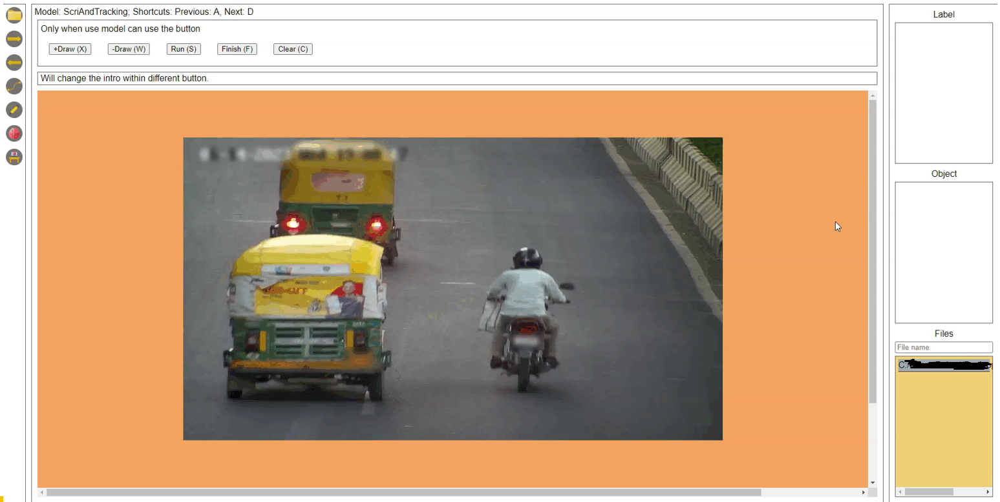

# car_scrib



## 使用 pipreqs 
去取得當前專案的環境

```shell
pip install pipreqs
pipreqs ./ --encoding=utf8
```


# 直接下載(包含weight和環境)
下載連結
[Download]([./static/labell.png](https://drive.google.com/file/d/1ICzBzkj8ER_vrwRxY_esvK_cPykXSJLa/view?usp=sharing))

取得conda環境
```shell
#Create fold for the env
\Users\username\anaconda3\envs\[env name]
cd C:\Users\username\anaconda3\envs\[env name]
# 取得環境
tar -xzf env.tar.gz  #the gz file is in the download link
```
